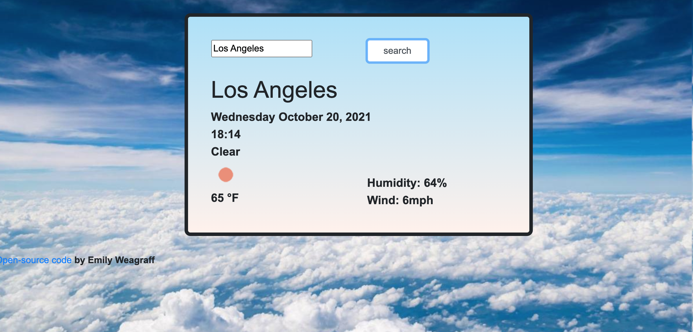

# Weather App

## Description

The weather app is a front-end web application that uses the open weather API to pull current weather information for any city in the world. It also displays real time and date of the city you are currently in.

## Table of Contents

[Description](#description)
 
[Installation](#installation)
 
[Usage](#usage)
 
[Deployment](#deployment)
 
[Screenshot](#screenshot)
 
[Contributions](#contributions)
 
[License](#license)

## Installation

Clone the repo to your local machine

## Screenshot

## Deployment

[Weather App](https://eweagraff.github.io/vanilla-weather-app/)

## Contributions

Please contact me if you would like to help contribute to the development of this application.

## License

MIT License

Copyright (c) 2021 Emily Weagraff

Permission is hereby granted, free of charge, to any person obtaining a copy
of this software and associated documentation files (the "Software"), to deal
in the Software without restriction, including without limitation the rights
to use, copy, modify, merge, publish, distribute, sublicense, and/or sell
copies of the Software, and to permit persons to whom the Software is
furnished to do so, subject to the following conditions:

The above copyright notice and this permission notice shall be included in all
copies or substantial portions of the Software.

THE SOFTWARE IS PROVIDED "AS IS", WITHOUT WARRANTY OF ANY KIND, EXPRESS OR
IMPLIED, INCLUDING BUT NOT LIMITED TO THE WARRANTIES OF MERCHANTABILITY,
FITNESS FOR A PARTICULAR PURPOSE AND NONINFRINGEMENT. IN NO EVENT SHALL THE
AUTHORS OR COPYRIGHT HOLDERS BE LIABLE FOR ANY CLAIM, DAMAGES OR OTHER
LIABILITY, WHETHER IN AN ACTION OF CONTRACT, TORT OR OTHERWISE, ARISING FROM,
OUT OF OR IN CONNECTION WITH THE SOFTWARE OR THE USE OR OTHER DEALINGS IN THE
SOFTWARE.
